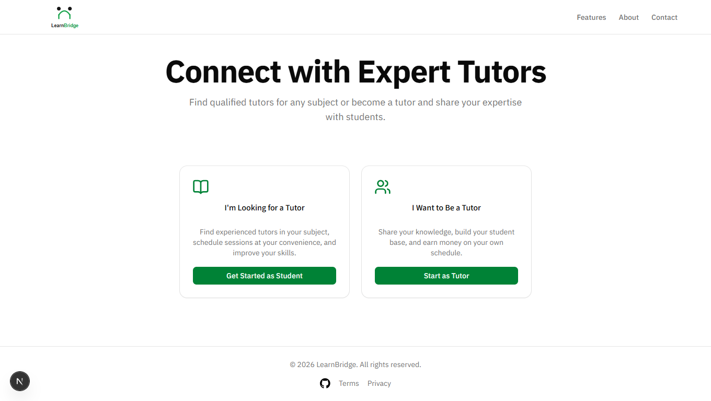
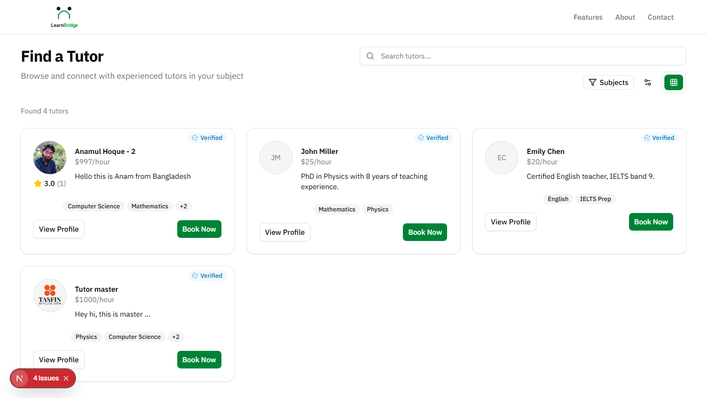
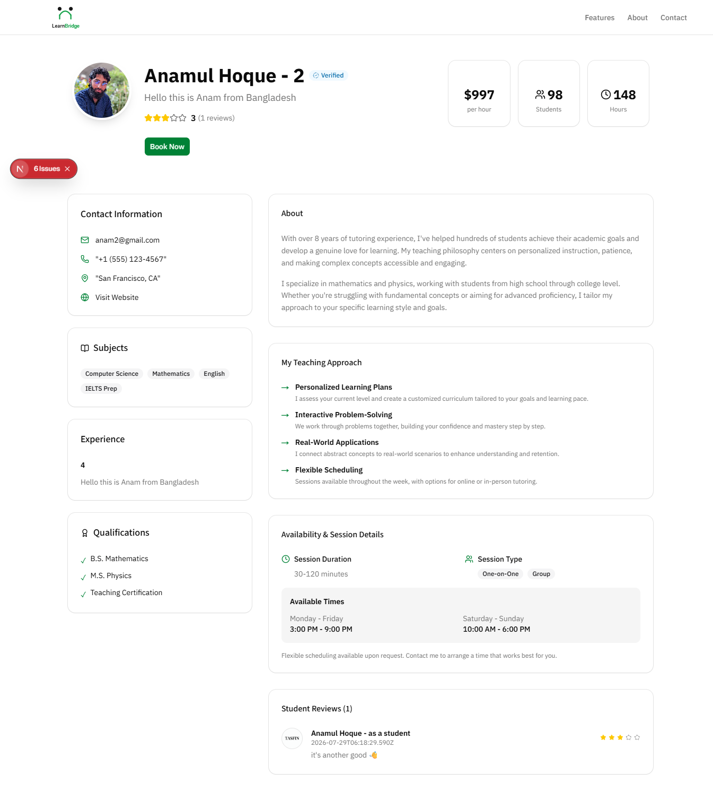
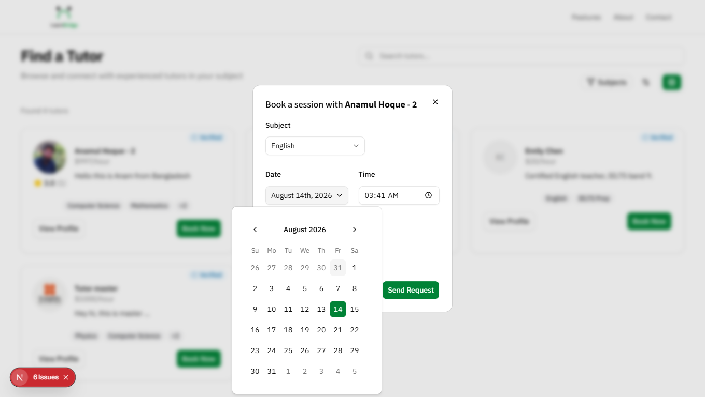
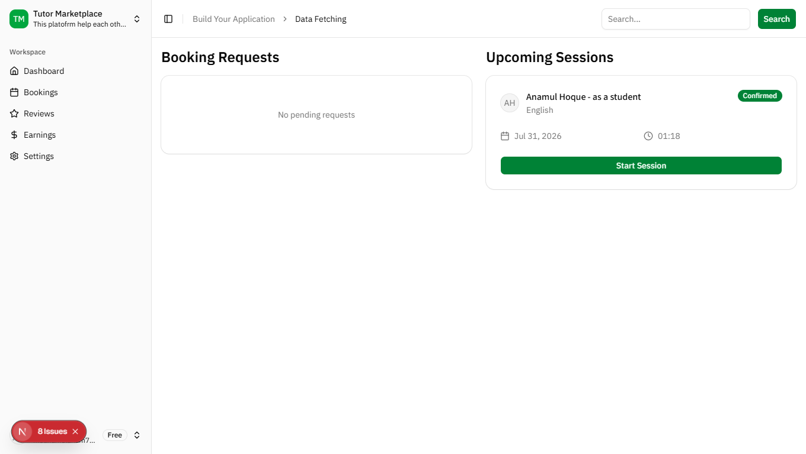
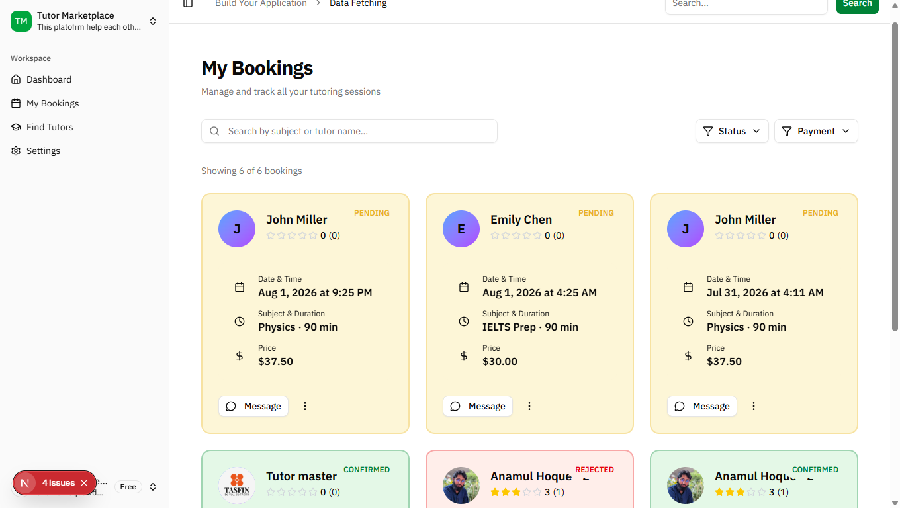
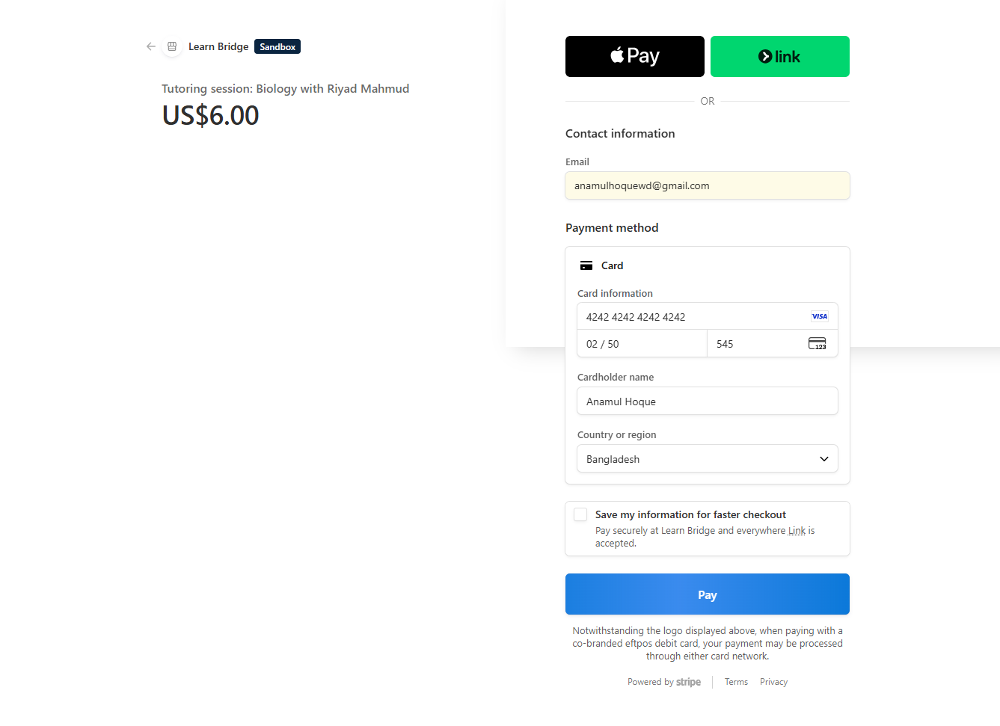

# LearnBridge — Tutoring Marketplace Platform

A full-stack, two-sided tutoring marketplace connecting students with tutors — built as a portfolio project from scratch to deployed MVP in **5 days**.

🔗 **Live Demo:** [https://learnbridge-tutor.vercel.app](https://learnbridge-tutor.vercel.app)
<!-- 🎥 **Demo Video:** _[add your Loom/YouTube link here]_ -->
💻 **Repo:** [https://github.com/anamulhoquewd/learnBridge](https://github.com/anamulhoquewd/learnBridge)

---

## The Story

This project didn't start as a 5-day sprint. When I first scoped it out, the natural, "do-it-properly" plan was a phased roadmap spread across several weeks — auth and data models first, then core marketplace features, then payments, then polish, each phase given its own breathing room.

But I only had **5 days off** to actually build it. So the full roadmap got compressed: same feature set, same production-quality bar, just re-planned into a tight, hour-by-hour 5-day schedule — and executed. What you're looking at is the result of that compressed sprint: a working, deployed, end-to-end marketplace, not a slide-deck plan.

---

## Features

- **Role-based authentication** (Student / Tutor) via Supabase Auth
- **Tutor profiles** — subjects taught, hourly rate, bio, years of experience, profile photo
- **Search & filter** — find tutors by subject, keyword, and price range
- **Booking system** — students send session requests; tutors accept or reject; students can cancel
- **Secure payments** — Stripe Checkout (test mode) with webhook-driven status updates
- **Reviews & ratings** — students rate completed sessions; average rating shown on tutor profiles
- **Responsive UI** — usable across desktop and mobile

---

## Tech Stack

| Layer | Technology |
|---|---|
| Framework | Next.js (App Router) + TypeScript |
| Styling | Tailwind CSS + shadcn/ui |
| Database | PostgreSQL (Supabase) |
| ORM | Prisma |
| Auth | Supabase Auth |
| File Storage | Cloudflare R2 (S3-compatible, via AWS SDK) |
| Payments | Stripe Checkout + Webhooks |
| Hosting | Vercel |

---

## Screenshots

### Landing Page

_The homepage — hero section, value props, and calls-to-action for both students and tutors._

### Tutor Search & Listing

_Browsing tutors with subject and keyword filters applied._

### Tutor Profile Page

_A public tutor profile — subjects, rate, bio, and reviews with average rating._

### Booking Flow

_A student sending a session request — subject, date, time, and duration._

### Tutor Dashboard — Booking Requests

_Tutor view of incoming requests, with Accept/Reject actions._

### Student Dashboard — My Bookings

_A student's booking history with live status (Pending / Confirmed / Rejected / Cancelled)._

### Stripe Checkout

_Secure payment for a confirmed session, powered by Stripe (test mode)._

---

## Architecture

This is a full-stack, monolithic Next.js application: API routes (`app/api/`) serve as the backend layer, with Prisma ORM handling database access against a Supabase-hosted PostgreSQL instance. This approach was chosen deliberately for a 5-day build — it avoids the overhead of managing and deploying a separate backend service, while still keeping a clean separation of concerns (routes → validation schemas → data layer).

```
app/
├── (marketing)/        → public pages (landing, tutor search, tutor profiles)
├── (auth)/              → login, signup
├── (private)/
│   ├── student/         → student dashboard (bookings, settings)
│   └── tutor/            → tutor dashboard (profile, bookings, earnings, reviews)
└── api/
    ├── auth/
    ├── bookings/
    ├── tutor-profile/
    ├── tutors/
    ├── payments/
    ├── reviews/
    └── upload/
```

**Key data models:** `Profile` (base identity + role), `TutorProfile` (tutor-only extension data — subjects, rate, bio), `Booking` (request/accept/reject/cancel lifecycle), `Payment` (Stripe session tracking), `Review` (rating + comment, tied 1:1 to a booking).

---

## Local Setup

```bash
git clone <your-repo-url>
cd learnbridge
npm install
```

Create a `.env.local` file with the following variables:

```env
NEXT_PUBLIC_SUPABASE_URL=
NEXT_PUBLIC_SUPABASE_ANON_KEY=
SUPABASE_SERVICE_ROLE_KEY=
DATABASE_URL=
DIRECT_URL=
R2_ACCOUNT_ID=
R2_ACCESS_KEY_ID=
R2_SECRET_ACCESS_KEY=
R2_BUCKET_NAME=
R2_PUBLIC_URL=
NEXT_PUBLIC_STRIPE_PUBLISHABLE_KEY=
STRIPE_SECRET_KEY=
STRIPE_WEBHOOK_SECRET=
NEXT_PUBLIC_APP_URL=http://localhost:3000
```

```bash
npx prisma generate
npx prisma migrate dev
npx prisma db seed
npm run dev
```

For local Stripe webhook testing, run in a separate terminal:
```bash
stripe listen --forward-to localhost:3000/api/payments/webhook
```

---

## Challenges & Solutions

- **Mid-project Prisma major version bump:** A fresh `npm install` mid-build pulled in Prisma 7, which moved datasource configuration out of `schema.prisma` entirely and required driver adapters. Given the timeline, I pinned the project to Prisma 6.x, which kept the schema-based datasource approach stable and let me move forward without a structural rewrite.
- **Timezone-safe date/time handling:** An early version combined a date picker's value with `.toISOString()` directly, which silently shifted the stored date by a day for timezones ahead of UTC (midnight local time converts to the previous day in UTC). Fixed by capturing date and time as separate fields and combining them with `setHours()` on the local `Date` object before a single, final UTC conversion.
- **Local vs. production Stripe webhooks:** Used the Stripe CLI to forward events to `localhost` during development, then created a separate, permanent webhook destination pointed at the production Vercel URL for the deployed environment — each with its own signing secret.
- **IDOR prevention on booking actions:** Added explicit ownership checks (e.g. `booking.tutorId !== user.id`) on accept/reject/payment endpoints so that one user account can never mutate another user's booking, even if the request bypasses the UI.

---

## Known Limitations (by design, for a 5-day MVP)

- No real-time chat between student and tutor
- No calendar-based availability/conflict checking — booking relies on manual coordination
- No admin dashboard for tutor verification or dispute resolution
- Session "completion" is not automatically tracked; reviews are enabled once a booking is confirmed rather than after a verified session end
- Timezone handling assumes all users are in a similar timezone (no explicit timezone conversion library in use yet)

---

## Future Improvements

- Real-time chat between student and tutor
- Calendar-based availability picker with conflict prevention
- Admin dashboard for tutor verification and dispute resolution
- Email notifications for booking status changes
- Video call integration for sessions
- PayPal as an additional payment option

---

## License

MIT